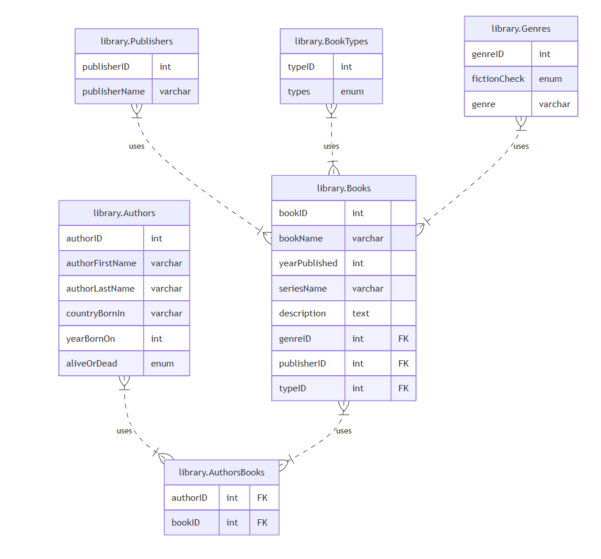

# 📝 Project Title: Library Management System

## 📌 Project Description:

Design and implement a full-featured database using MySQL for library system, with defining the relationship between various tables.

## 🚩 The Entity Relationship Diagram (ERD):

## 🛠️ How To Run:

✅ Open MySQL WorkBench.
✅ Import the SQL file.
✅ Run it.
